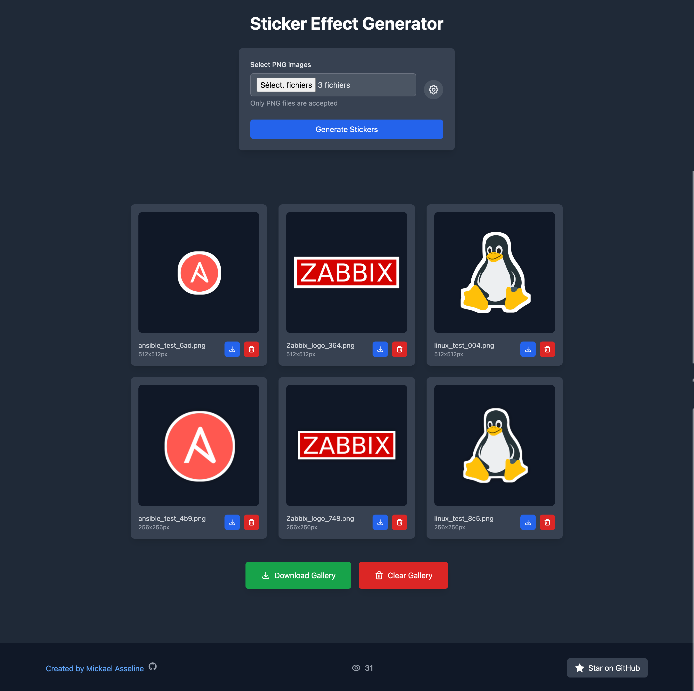
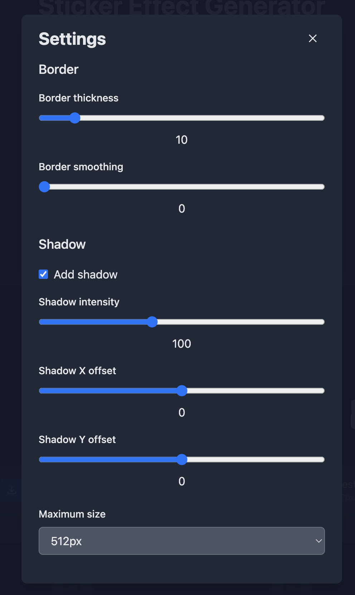

<p align="center">
  <a href="https://mickaelasseline.com">
    
  </a>
</p>

<p align="center">
  <a href="#"></a>
</p>

<p align="center">
  <a href="https://sticker.papamica.com">
    
  </a>
</p>


A web application that allows you to create sticker effects for PNG images with customizable borders, shadows and other effects.





## Features

- Upload multiple PNG images at once
- Customize border thickness and smoothing
- Add customizable shadows with:
  - Adjustable intensity
  - X/Y offset controls
- Fill holes in transparent areas for better sticker effect
- Choose output size (256px, 512px or 1024px)
- Preview generated stickers in gallery
- Download individual stickers or entire gallery as ZIP
- Delete individual stickers or clear gallery
- Mobile-friendly interface

## Deployment

```
git clone https://github.com/PAPAMICA/sticker_effect.git
cd sticker_effect
docker-compose up -d
```

## Usage

Demo: [https://sticker.papamica.com](https://sticker.papamica.com)

1. Click "Select PNG images" to choose one or more PNG files
2. Adjust settings (optional):
   - Border thickness (5-50px)
   - Border smoothing (0-10)
   - Fill holes in image (for better sticker effect)
   - Shadow options (if enabled):
     - Intensity (0-255)
     - X/Y offset (-50px to +50px)
   - Maximum output size (256px, 512px, 1024px)
3. Click "Generate Stickers" to process images
4. Preview results in the gallery
5. Download individual stickers or use "Download Gallery" for all
6. Delete unwanted stickers or clear gallery as needed

## Technologies Used

- Backend:
  - Flask (Python web framework)
  - Pillow (Python Imaging Library)
- Frontend:
  - HTMX (Dynamic HTML updates)
  - TailwindCSS (Styling)
  - Alpine.js (JavaScript functionality)
  - Fancybox (Image gallery/lightbox)

## Contributing

Contributions are welcome! Please feel free to submit a Pull Request.
